# Nigeria Education Data Integration and Analysis

This project brings together education data from the United Nations and the World Bank to explore school enrolment, adult literacy and gender inequality in Nigeria.

The project combines file-based data with API data and uses MongoDB, PostgreSQL and Python to build an end-to-end data integration pipeline.

The analysis covers the period from 2000 to 2023, although some sources only contain observations for selected years.

## Team Project

This was a three-person group project completed by:

- Efe Matthew Akpovwovwo
- Madugba Princewill Chukwuemeka
- Adebonojo Adesayo Oluwatosin

The work in this repository was completed collaboratively, with different parts of the data collection, processing, database integration and analysis divided between the team members.

For this portfolio version, the individual notebooks have been retained to show each team member's contribution, while the final analysis brings the three datasets together into one integrated educational dataset.

## Project Goals

The main goals of the project were to:

- collect education data from different sources
- work with both API and file-based data
- store raw API data in MongoDB
- clean and transform the data with Python and Pandas
- store structured datasets in PostgreSQL
- combine the different datasets using country and year
- analyse male and female education indicators
- examine gender gaps in enrolment and literacy
- create clear visualisations from the final data

## Data Sources

### United Nations Education Data

The United Nations dataset was used to analyse Nigerian student enrolment and gross enrolment ratios.

The cleaned data includes:

- primary male gross enrolment ratio
- primary female gross enrolment ratio
- lower secondary male gross enrolment ratio
- lower secondary female gross enrolment ratio
- upper secondary male gross enrolment ratio
- upper secondary female gross enrolment ratio
- total student enrolment by education level

The final UN comparison contains selected observations for:

- 2005
- 2010
- 2015
- 2021

### World Bank Enrolment Data

World Bank enrolment data was collected through the World Bank API.

The indicators used were:

- `SE.PRM.ENRR.FE` - Primary gross enrolment ratio, female
- `SE.PRM.ENRR.MA` - Primary gross enrolment ratio, male
- `SE.SEC.ENRR.FE` - Secondary gross enrolment ratio, female
- `SE.SEC.ENRR.MA` - Secondary gross enrolment ratio, male

The raw API records were stored in MongoDB before being flattened, transformed and written to PostgreSQL.

### World Bank Adult Literacy Data

Adult literacy data was also collected from the World Bank API.

The indicators used were:

- `SE.ADT.LITR.FE.ZS` - Adult female literacy rate
- `SE.ADT.LITR.MA.ZS` - Adult male literacy rate

The literacy data is much more sparse than the enrolment data.

Only a small number of literacy observations are reported across the 2000 to 2023 period, so linear interpolation was used to create a continuous yearly series for analysis.

The original reported values were kept separately from the interpolated values so that the distinction between observed and estimated values remains clear.

## Individual Contributions

### Efe Matthew Akpovwovwo

Efe worked mainly with the United Nations education dataset.

The work included:

- cleaning the UN dataset
- parsing education level and sex from the indicators
- separating enrolment ratios from total student enrolment values
- preparing Nigeria-specific records
- reshaping the data into a wide format
- preparing the UN data for integration with the other datasets
- creating UN enrolment visualisations

The final cleaned UN dataset includes both male and female enrolment ratios across primary, lower secondary and upper secondary education.

### Madugba Princewill Chukwuemeka

Princewill worked with World Bank gender enrolment data.

The pipeline included:

1. collecting enrolment data from the World Bank API
2. storing the raw API records in MongoDB
3. flattening the MongoDB records into a Pandas DataFrame
4. labelling each record by education level and sex
5. pivoting the data into male and female enrolment columns
6. calculating primary and secondary gender gaps
7. storing the cleaned result in PostgreSQL
8. creating enrolment and gender-gap visualisations

The final PostgreSQL table created from this part of the project is:

`wb_gender_enrolment`

### Adebonojo Adesayo Oluwatosin

Sayo worked with World Bank adult literacy data and the final integration stage.

The work included:

- collecting male and female literacy data from the World Bank API
- storing raw records in MongoDB
- cleaning the Nigeria literacy records
- identifying reported and missing observations
- applying linear interpolation to missing yearly literacy values
- calculating the male-female literacy gap
- storing the cleaned literacy data in PostgreSQL
- combining the literacy, World Bank enrolment and United Nations datasets
- creating literacy and integrated comparison visualisations

The final literacy table is:

`gender_literacy_final`

The final combined table is:

`education_final_merged`

## Data Integration

The final stage combines all three parts of the project.

```text
Efe
United Nations enrolment data
              \
               \
                +-------------------+
                                    |
Princewill                           |
World Bank enrolment data ----------+----> Final Integrated Dataset
                                    |              |
Sayo                                |              v
World Bank literacy data -----------+     PostgreSQL
                                           |
                                           v
                                education_final_merged
```

The datasets are joined using:

```text
country_code
year
```

The final integrated dataset contains 24 yearly records covering 2000 to 2023.

After cleaning and validation:

- only Nigeria records are included
- the country code is `NGA`
- duplicate years = 0
- both male and female UN primary enrolment data are available
- World Bank male and female enrolment data are included
- reported literacy values are kept separately from interpolated literacy values

The final combined dataset is stored in PostgreSQL as:

`education_final_merged`

## Database Pipeline

The project uses both MongoDB and PostgreSQL.

```text
World Bank API
      |
      v
   MongoDB
  Raw Records
      |
      v
Python / Pandas
Cleaning and Transformation
      |
      v
  PostgreSQL
Structured Tables
      |
      v
Final Data Integration
      |
      v
Analysis and Visualisation
```

MongoDB was used to store raw API responses before transformation.

PostgreSQL was used for the cleaned relational datasets and the final integrated table.

## Main PostgreSQL Tables

### `wb_gender_enrolment`

This table contains World Bank school enrolment data including:

- primary female enrolment
- primary male enrolment
- secondary female enrolment
- secondary male enrolment
- primary gender gap
- secondary gender gap

The gender gap is calculated as:

```text
Female enrolment - Male enrolment
```

A negative value means male enrolment was higher.

A positive value means female enrolment was higher.

### `gender_literacy_final`

This table contains:

- reported female literacy
- interpolated female literacy
- reported male literacy
- interpolated male literacy
- gender literacy gap

### `education_final_merged`

This is the final integrated table.

It combines:

- World Bank adult literacy data
- World Bank school enrolment data
- United Nations enrolment data

## Selected Visualisations

### UN Primary Gross Enrolment Ratio by Sex

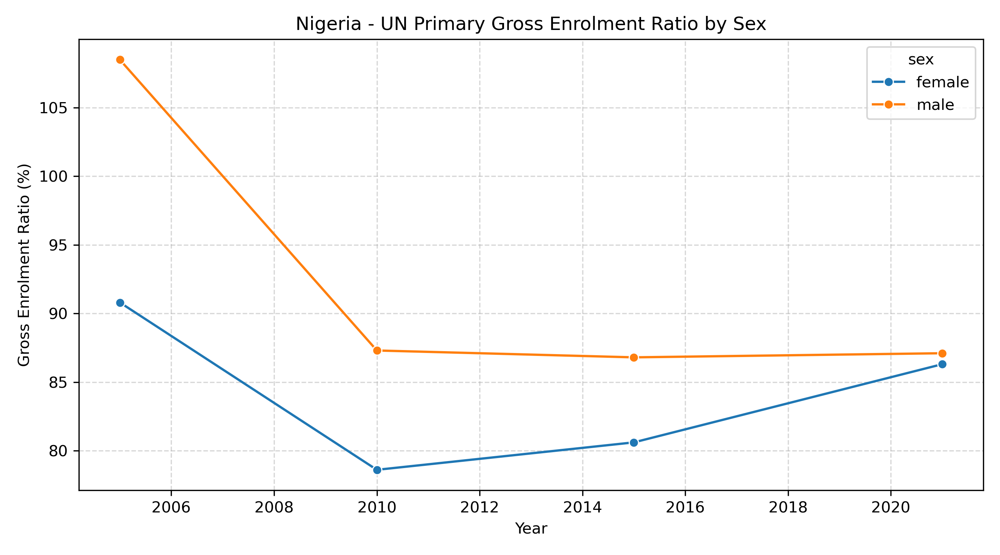

This chart compares male and female primary gross enrolment ratios using the selected United Nations observations.

### UN Enrolment by Education Level and Sex

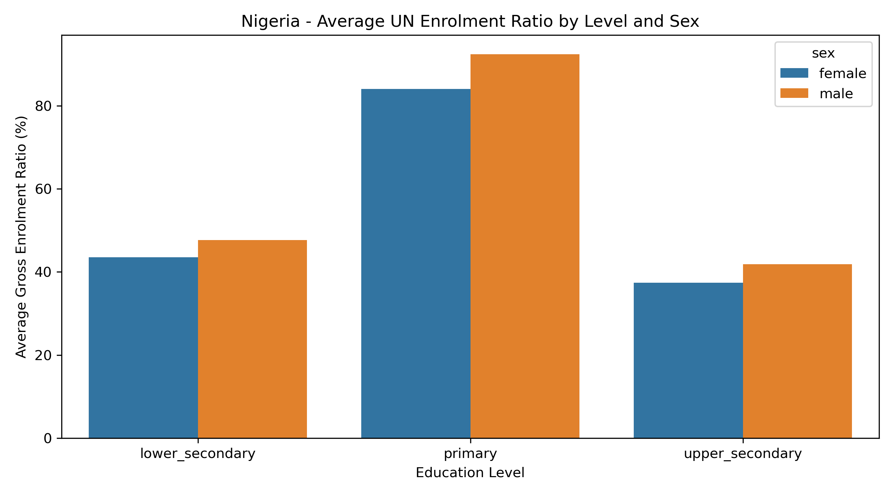

This chart compares average male and female gross enrolment ratios across primary, lower secondary and upper secondary education.

### UN Student Enrolment by Education Level

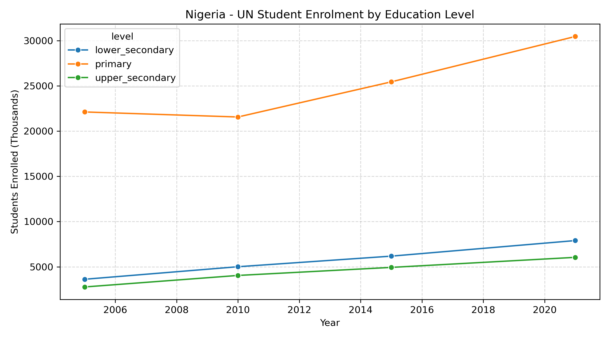

This chart shows total student enrolment across primary, lower secondary and upper secondary education.

### World Bank Primary Gross Enrolment Ratio by Sex

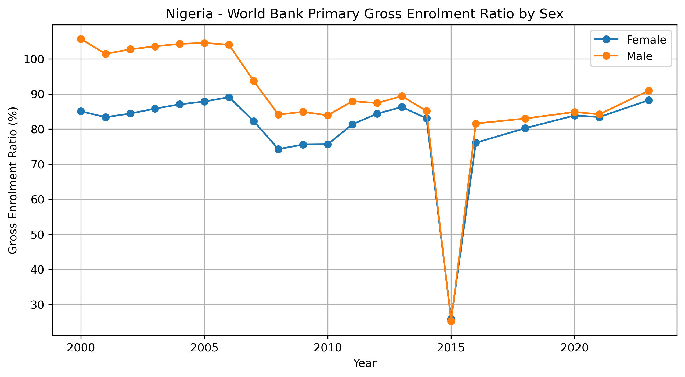

This chart shows the World Bank primary enrolment series for male and female students in Nigeria.

### World Bank Secondary Gross Enrolment Ratio by Sex

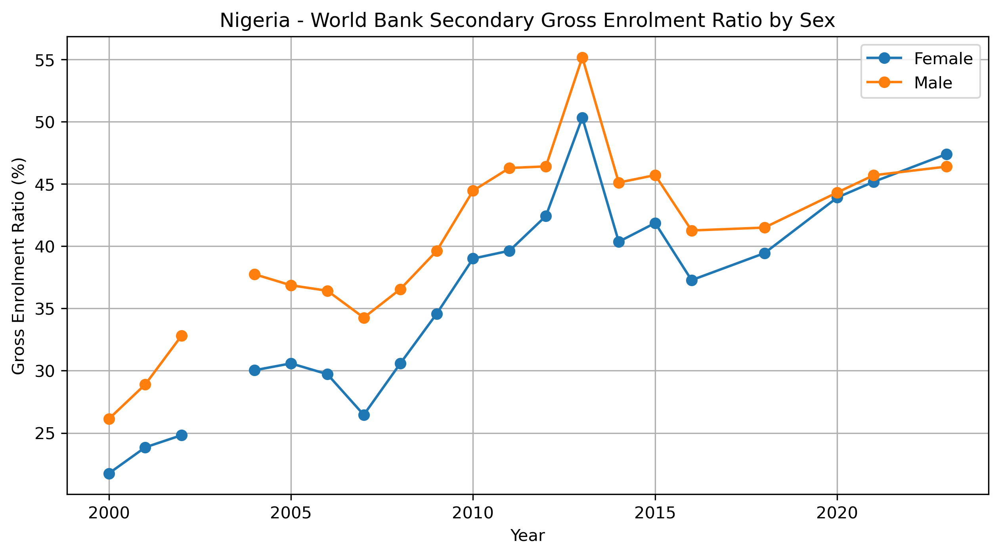

This chart shows the World Bank secondary gross enrolment ratio for male and female students.

### World Bank Gender Enrolment Gap

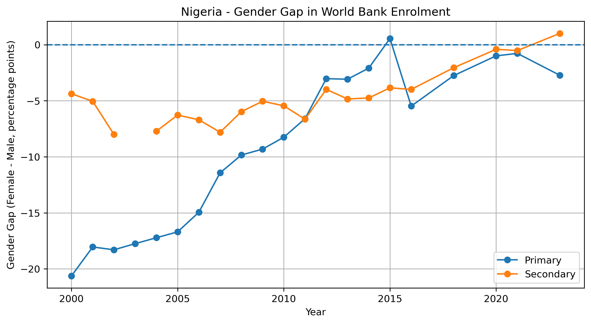

This chart shows how the difference between female and male enrolment changed over time at primary and secondary level.

The gap is measured in percentage points.

### Female Literacy and Primary Enrolment

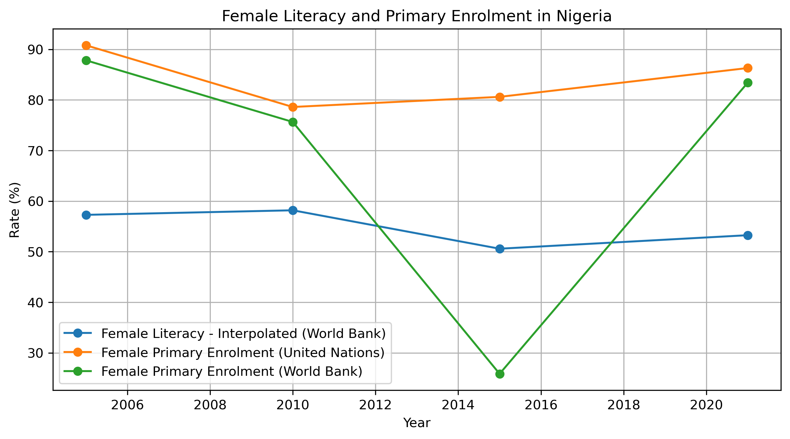

This visual combines data from all three parts of the project:

- Sayo's World Bank literacy data
- Princewill's World Bank primary enrolment data
- Efe's United Nations primary enrolment data

### Male Literacy and Primary Enrolment

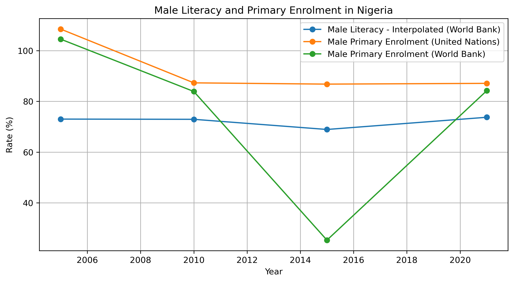

This provides the same three-source comparison for male education indicators.

### Interpolated Male vs Female Literacy

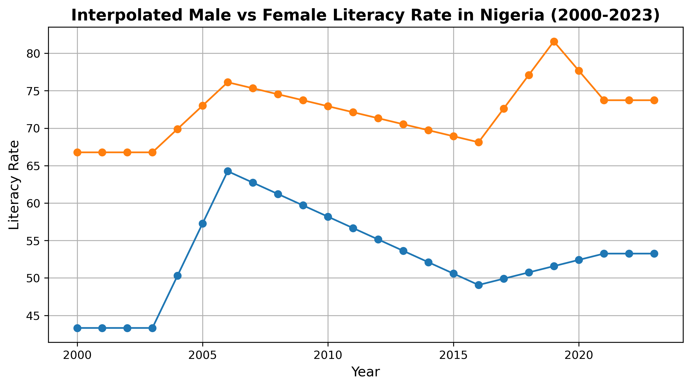

Because the World Bank literacy data contains many missing years, this chart uses the interpolated yearly literacy series.

### Interpolated Gender Literacy Gap

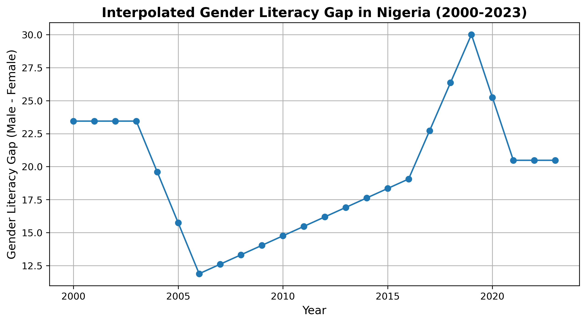

This chart shows the difference between interpolated male and female adult literacy rates over time.

### Distribution of the Interpolated Gender Literacy Gap

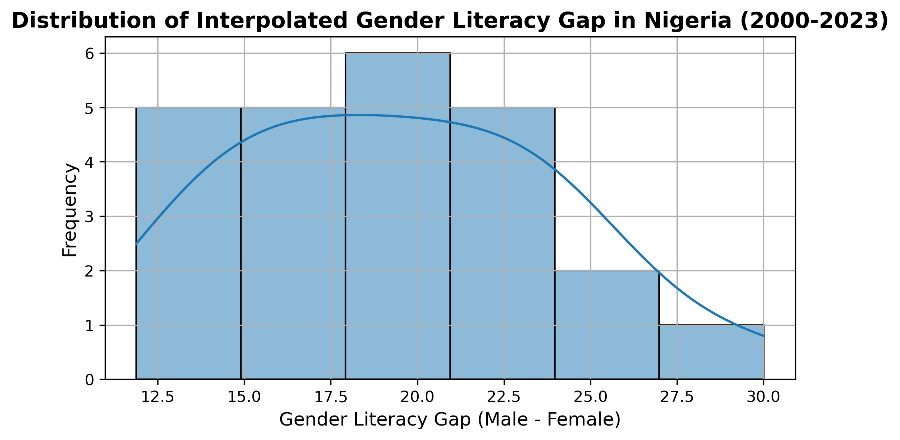

This chart shows the distribution of the interpolated gender literacy gap between 2000 and 2023.

### Literacy Missing Data

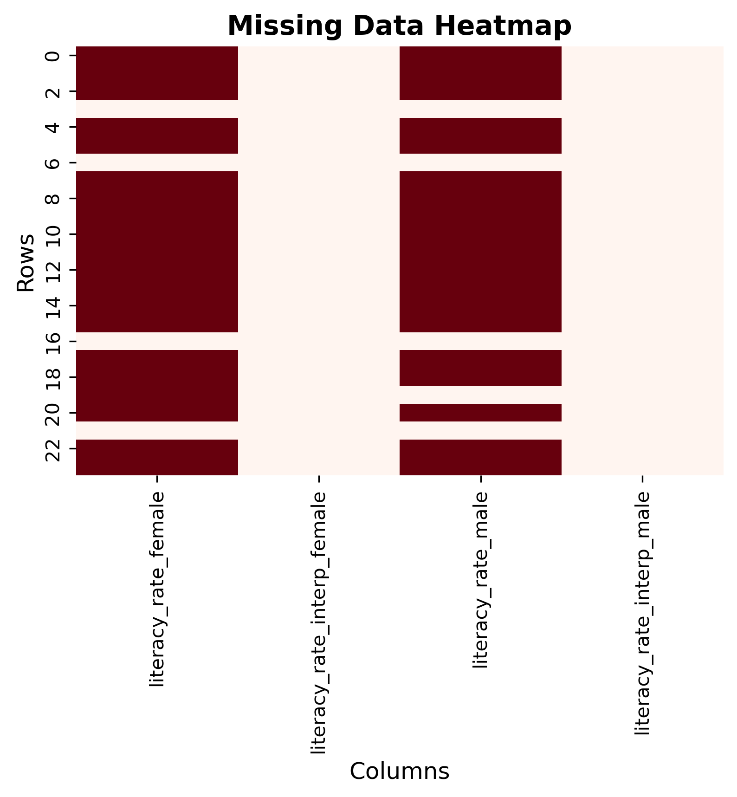

This heatmap shows the difference between the sparse reported literacy observations and the completed interpolated series.

## Important Data Notes

### Literacy Interpolation

The World Bank literacy dataset does not report a literacy value for every year.

Rather than presenting the missing years as original World Bank observations, the project keeps the original values and the interpolated values separately.

This makes it possible to analyse yearly trends while still showing which values came directly from the source.

### 2015 World Bank Primary Enrolment Value

The World Bank primary enrolment series contains a sharp fall in 2015 for both male and female enrolment.

This initially appeared unusual, so the values were checked directly against the World Bank API.

The same values are present in the source data, so they were retained rather than manually changed or removed.

### Gross Enrolment Ratios Can Exceed 100%

Some gross enrolment ratios in the datasets are above 100%.

This does not automatically mean the data is incorrect.

Gross enrolment ratio measures total enrolment in an education level regardless of age against the population of the official age group for that level.

Students who are younger or older than the official age group can therefore cause the ratio to exceed 100%.

## Project Structure

```text
nigeria-education-data-integration/
│
├── dataset/
│   └── efe_enrolment.csv
│
├── notebooks/
│   ├── efe_apdv_code.ipynb
│   ├── princewill_apdv_code.ipynb
│   └── sayo_apdv_code.ipynb
│
├── visualisations/
│   ├── efe_un_enrolment_by_level_and_sex.png
│   ├── efe_un_primary_enrolment_by_sex.png
│   ├── efe_un_total_enrolment_by_level.png
│   ├── prince_primary_enrolment_by_sex_nigeria.png
│   ├── prince_secondary_enrolment_by_sex_nigeria.png
│   ├── prince_gender_enrolment_gap_nigeria.png
│   ├── sayo_female_literacy_un_vs_world_bank_primary_enrolment.png
│   ├── sayo_male_literacy_un_vs_world_bank_primary_enrolment.png
│   ├── sayo_female_literacy_vs_primary_enrolment_2000_2013.png
│   ├── sayo_male_literacy_vs_primary_enrolment_2000_2013.png
│   ├── sayo_interpolated_male_vs_female_literacy_2000_2023.png
│   ├── sayo_interpolated_gender_literacy_gap_trend_2000_2023.png
│   ├── sayo_interpolated_gender_literacy_gap_distribution_2000_2023.png
│   └── sayo_literacy_missing_data_heatmap_2000_2023.png
│
├── .gitignore
├── README.md
└── requirements.txt
```

## Technologies Used

- Python
- Pandas
- NumPy
- Requests
- MongoDB
- PostgreSQL
- SQLAlchemy
- Psycopg2
- Matplotlib
- Seaborn
- Jupyter Notebook
- Docker
- World Bank API

## Running the Project

The notebooks use environment variables for the MongoDB and PostgreSQL connections.

Create a local `data.env` file in the root project folder.

Example:

```text
DATABASE_USERNAME=your_postgres_username
DATABASE_PASSWORD=your_postgres_password
DATABASE_HOST=localhost
DATABASE_PORT=5432
DATABASE_NAME=apdv_project

MONGO_USERNAME=your_mongodb_username
MONGO_PASSWORD=your_mongodb_password
MONGO_HOST=localhost
MONGO_PORT=27017
MONGO_DB=apdv_project
MONGO_COLLECTION=world_bank_enrolment_raw
```

The `data.env` file is excluded from Git through `.gitignore` and should not be committed to the repository.

Install the required Python packages with:

```bash
pip install -r requirements.txt
```

MongoDB and PostgreSQL must also be running before executing the database sections of the notebooks.

The notebooks can then be run from the `notebooks` folder.

## Requirements

The main Python packages used in the project are:

- pandas
- numpy
- requests
- pymongo
- SQLAlchemy
- psycopg2-binary
- python-dotenv
- matplotlib
- seaborn
- jupyter

## What This Project Demonstrates

This project goes beyond a single CSV analysis.

It demonstrates:

- API data collection
- file-based data cleaning
- NoSQL data storage
- PostgreSQL database storage
- ETL workflows
- data integration from multiple sources
- missing-data handling
- interpolation
- gender-gap analysis
- data validation
- Python visualisation
- working with real-world data quality problems

The final result is a single integrated education dataset that brings together enrolment and literacy information from the United Nations and the World Bank and makes it possible to compare male and female education indicators in Nigeria over time.